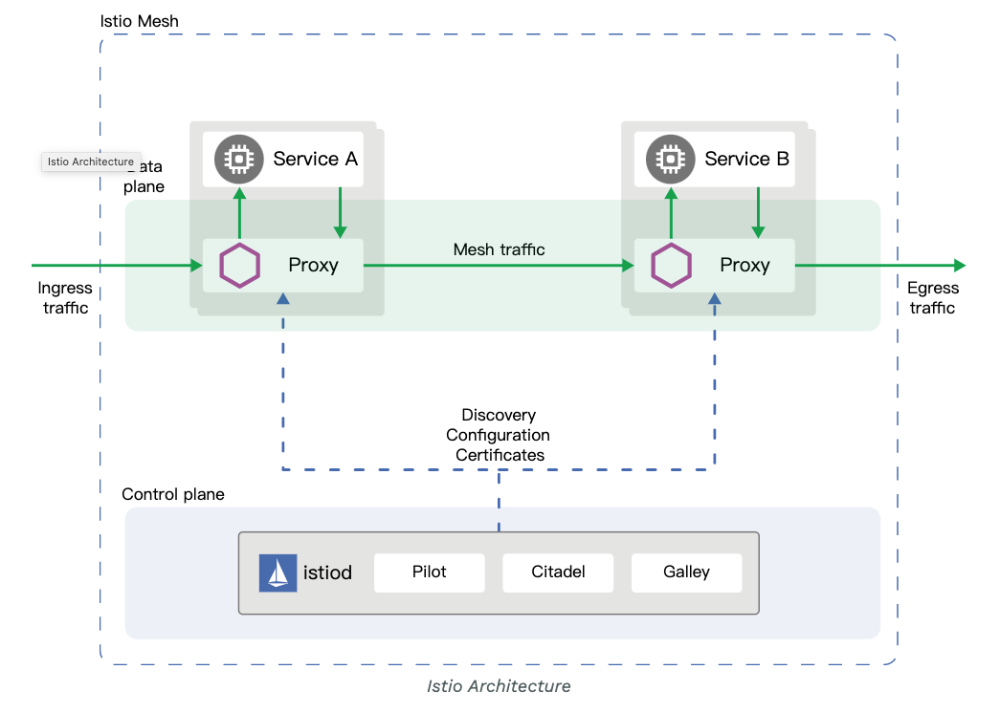

# proxy-istio-demo

该项目主要是模拟 从应用程序容器到Sidecar代理的流量 基本的实现原理

测试

```bash

$ curl localhost:8080  -vv -w "\n timeout ---> %{time_total} \n"

*   Trying ::1...
* TCP_NODELAY set
* Connected to localhost (::1) port 8888 (#0)
> GET / HTTP/1.1
> Host: localhost:8888
> User-Agent: curl/7.64.1
> Accept: */*
>
< HTTP/1.1 200 OK
< Content-Type: application/json
< Date: Thu, 25 Feb 2021 06:04:38 GMT
< demo ->: java
< response proxy header: xx2
< Content-Length: 11
<
* Connection #0 to host localhost left intact
{"up":true}
 timeout ---> 6.007932
* Closing connection 0
```



## demo
一个demo的项目
启动了一个端口 `8080` 主要用来测试

```bash
$ curl http://localhost:8080\?a\=b -v


*   Trying ::1...
* TCP_NODELAY set
* Connected to localhost (::1) port 8080 (#0)
> GET /?a=b HTTP/1.1
> Host: localhost:8080
> User-Agent: curl/7.64.1
> Accept: */*
>
< HTTP/1.1 200 OK
< hello world: demo
< Date: Mon, 22 Feb 2021 15:25:31 GMT
< Content-Length: 11
< Content-Type: text/plain; charset=utf-8
<
* Connection #0 to host localhost left intact
{"up":true}* Closing connection 0

```

响应为

```bash

body

{"up":true}

header:

hello world: demo

```


## proxy 代理服务


```bash

$ curl http://localhost:8888?a=b -v

*   Trying ::1...
* TCP_NODELAY set
* Connected to localhost (::1) port 8888 (#0)
> GET /?a=b HTTP/1.1
> Host: localhost:8888
> User-Agent: curl/7.64.1
> Accept: */*
>
< HTTP/1.1 200 OK
< Content-Length: 11
< Content-Type: text/plain; charset=utf-8
< Date: Thu, 25 Feb 2021 01:49:42 GMT
< hello world: demo
< response proxy header: xx2
<
* Connection #0 to host localhost left intact
{"up":true}* Closing connection 0
```

## sidecar-init


使用iptables的命令行 将流量打到demo服务的流量 重定向到proxy 服务


